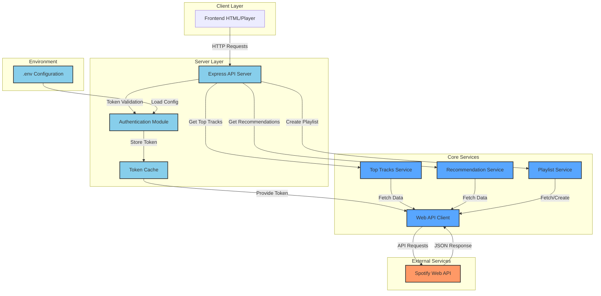
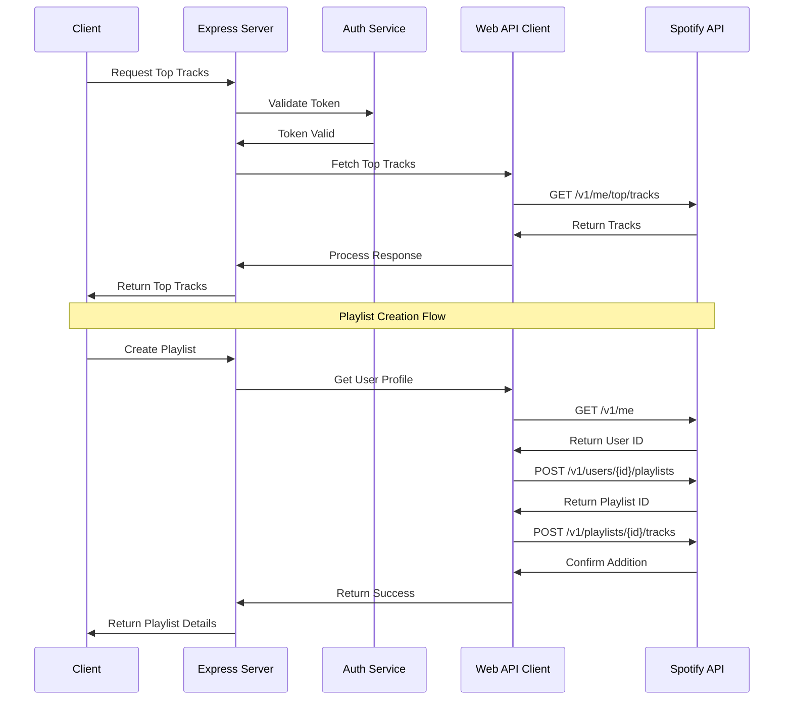

# 🎵 Melodify

> A sophisticated toolkit for enhancing your Spotify experience through AI-powered music discovery and playlist management.

[](https://choosealicense.com/licenses/mit/)
[](https://badge.fury.io/js/melodify)
[](https://github.com/bniladridas/melodify/graphs/commit-activity)
[](https://melody-three.vercel.app)


## 📋 Table of Contents
- [🎵 Melodify](#-melodify)
  - [📋 Table of Contents](#-table-of-contents)
  - [🚀 Overview](#-overview)
  - [✨ Features](#-features)
    - [🎧 Smart Track Analysis](#-smart-track-analysis)
    - [🤖 Intelligent Music Recommendations](#-intelligent-music-recommendations)
    - [📝 Playlist Management](#-playlist-management)
  - [🏗 System Architecture](#-system-architecture)
    - [Component Architecture](#component-architecture)
    - [Sequence Flow](#sequence-flow)
    - [Technical Stack](#technical-stack)
  - [🛠️ Prerequisites](#️-prerequisites)
  - [🛠️ Installation](#️-installation)
  - [📖 Usage](#-usage)
    - [Initialize Top Tracks Analysis](#initialize-top-tracks-analysis)
    - [Generate Recommendations](#generate-recommendations)
    - [Create a New Playlist](#create-a-new-playlist)
    - [Example Output](#example-output)
  - [🔑 API Authentication](#-api-authentication)
  - [🤝 Contributing](#-contributing)
  - [🔨 Development](#-development)
    - [Prerequisites](#prerequisites)
    - [Setting up the development environment](#setting-up-the-development-environment)
  - [🛠️ Troubleshooting](#️-troubleshooting)
    - [Common Issues](#common-issues)
  - [📄 License](#-license)
  - [🙏 Acknowledgments](#-acknowledgments)

## 🚀 Overview

Melodify is an advanced Node.js application that leverages the Spotify Web API to transform how you discover and organize music. By combining machine learning with Spotify's extensive music library, Melodify provides personalized music recommendations and seamless playlist management capabilities.

## ✨ Features

### 🎧 Smart Track Analysis
- Extract your top tracks across different time ranges:
  - Short-term (last 4 weeks)
  - Medium-term (last 6 months)
  - Long-term (all time)
- Detailed audio feature analysis for each track

### 🤖 Intelligent Music Recommendations
- Hybrid recommendation engine combining:
  - Collaborative filtering based on user listening patterns
  - Content-based filtering using audio features
  - Contextual awareness for time-of-day appropriate suggestions
- Personalized song suggestions based on your unique taste profile

### 📝 Playlist Management
- Create and manage Spotify playlists programmatically
- Smart playlist generation based on:
  - Mood and energy levels
  - Genre combinations
  - Tempo and rhythm patterns
- Bulk track operations with error handling

## 🏗 System Architecture

### Component Architecture
The system is built using a modern, scalable architecture with clear separation of concerns:



### Sequence Flow
This diagram illustrates the interaction flow between different components:



### Technical Stack
- **Frontend**: HTML5, CSS3, JavaScript
- **Backend**: Node.js, Express.js
- **Authentication**: OAuth 2.0
- **API Integration**: Spotify Web API
- **Caching**: In-memory cache for tokens
- **Error Handling**: Global error middleware

## 🛠️ Prerequisites

- Node.js >= 14.x
- npm >= 6.x
- Spotify Developer Account

## 🛠️ Installation

1. Clone the repository:
```bash
git clone https://github.com/bniladridas/melodify.git
```

2. Navigate to the project directory:
```bash
cd melodify
```

3. Install dependencies:
```bash
npm install
```

4. Configure environment variables:
```bash
cp .env.example .env
# Edit .env with your Spotify API credentials
```

## 📖 Usage

### Initialize Top Tracks Analysis
```javascript
const melodify = require('melodify');
await melodify.analyzeTopTracks('short_term');
```

### Generate Recommendations
```javascript
const recommendations = await melodify.recommendSongs({
  limit: 20,
  seedTracks: ['trackId1', 'trackId2'],
  targetEnergy: 0.8
});
```

### Create a New Playlist
```javascript
const playlist = await melodify.createPlaylist({
  name: 'My Awesome Mix',
  description: 'Generated using Melodify',
  public: true
});
```
### Example Output
```
➜  spotify git:(main) ✗ node [spotifyProject.js](http://_vscodecontentref_/0)
Top Tracks: [
  'Under The Influence by Chris Brown',
  'Perfect by Ed Sheeran',
  'TiK ToK by Kesha',
  'Energy (Lucky Me) by Morgan St. Jean',
  'Way down We Go by KALEO'
]
Recommended Tracks: [
  'Collide (Sped Up Remix) by Justine Skye, Tyga',
  'Sensational (feat. Davido & Lojay) by Chris Brown, Davido, Lojay',
  "I'm a Mess by Ed Sheeran",
  'Time N Affection by Rema, Chris Brown',
  'golden hour by JVKE'
`
Created Playlist: My recommendation playlist, ID: 38yPvgmiuCUEzf8Qm3unYo
```
## 🔑 API Authentication

1. **Create a Spotify Developer Account**
   - Visit the [Spotify Developer Dashboard](https://developer.spotify.com/dashboard/)
   - Sign up for a developer account

2. **Register Your Application**
   - Create a new application in the Spotify Developer Dashboard
   - Note down the Client ID, Client Secret, and Redirect URI

3. **Set Environment Variables**
   - Add the following to your `.env` file:
   ```bash
   SPOTIFY_CLIENT_ID=your_client_id
   SPOTIFY_CLIENT_SECRET=your_client_secret
   SPOTIFY_REDIRECT_URI=your_redirect_uri
   ```

## 🤝 Contributing

Please read our [Contributing Guide](docs/CONTRIBUTING.md) for details on our code of conduct and the process for submitting pull requests.

## 🔨 Development

### Prerequisites
- Node.js >= 14.x
- npm >= 6.x
- Spotify Developer Account

### Setting up the development environment
1. Install dependencies: `npm install`
2. Start development server: `npm run dev`
3. Run tests: `npm test`

## 🛠️ Troubleshooting

### Common Issues

1. **Invalid Token Error**
   - Ensure your Spotify API credentials are correct
   - Check if the token has expired and refresh it if necessary

2. **Network Issues**
   - Verify your internet connection
   - Check if the Spotify API is reachable

## 📄 License

This project is licensed under the MIT License - see the [LICENSE](LICENSE) file for details.

## 🙏 Acknowledgments

- Spotify Web API team for providing excellent documentation
- Our amazing contributors and the open-source community
- All the music lovers who inspire us to keep improving

---

Made with ♥️ by the Melodify Team
